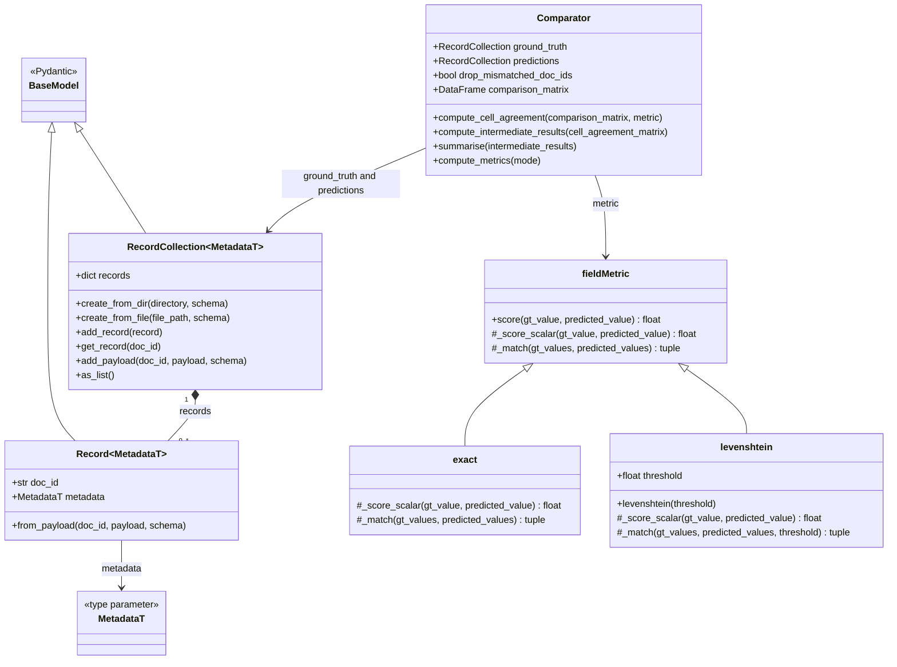

# BIBRA-Eval


Evaluating descriptive cataloguing records created with BIBRA.
[BIBRA](https://github.com/NatLibFi/BIBRA) is an (L)LM-based assistance
tool, to generate bibliographic metadata from a given PDF-Input.
`BIBRA-Eval` provides tooling to make direct comparisons of
LLM-generated BIBRA JSON-Records with gold-standard records coming from
a different source (e.g. manual indexing).

## Metrics

BIBRA-Eval requires records that follow a specific JSON-scheme. Built on
top of the record scheme is an evaluation scheme, that specifies the
fields that should be part of the comparison and the metrics that apply
to each field.

- binary metrics: some fields like `year` or `isbn` are best evaluated
  by requiring exact matches. So matches are either true or false
- string difference: fields like title or publisher should allow some
  degree of tolerance between two records. Here we measure the
  levenshtein distance, i.e. the minimal number of string edits that
  lead from field content `x` to the gold-standard content `y`
- llm-as-a-judge (`experimental`): fields with complex content, that may
  be expressed in equivalent but dissimilar form, may be judged by a
  light LLM
- metrics for list comparison: fields with multiple subfields (e.g. a
  list of authors) are aligned with a fuzzy match. The score per field
  is calculated as the average levenshtein distance between the matches

The evaluation scheme also supports optional weights per field,
e.g. correctness of the title could be more important then correctness
of the alt_title.

## Levels of evaluation

Metrics can be calculated along various levels:

- direct record comparison (record to record results): this forms the
  basis for all other computations
- field average: what is the average agreement across all documents in a
  test set along one particular field
- record average: what is the average agreement in a test set across all
  fields and documents

In determining results, there are different paths or modes for
aggregating results:

- document macro-average: compute average result per doc first (along
  all fields), then compute average across documents
- field macro-average: compute average results per field (along all
  documents), then compute average across all fields
- micro-average: no intermediate aggregation, average all field-to-field
  results in one

## Data format

The required input format is either a folder (`directory-format`) of
json-records following BIBRA’s JSON-Scheme or a single jsonl-file (
`single-file-format`) containing all records of a test set in a single
file.

For data in `directory-format` the gold-standard and the predictions
should be separate directories. Matches between records are performed on
the basis of record-file-names. So these should match between both
directories.

For data in ( `single-file-format`) a `doc_id` field is mandatory, to
make matches.

## Client

BIBRA-Eval provides a client to start evaluation from terminal.

Directory format:

``` bash
bibra-eval --mode field-avg GOLD-STANDRAD-DIR/ PREDICTIONS-DIR/
```

| field             | prec      | rec | f1  |
| ----------------- | --------- | --- | --- |
| title             | ...       | ... | ... |
| creator           | ...       | ... | ... |
| ...               | ...       | ... | ... |
| ----------------- |-----------|-----|-----|
| TOTAL (field-avg) | ...       | ... | ... |

The setting `--mode field-avg` is default. You can also use `micro` and
`doc-avg`.

## Python API

For interactive analysis BIBRA-Eval provides a python API to use in
individually tailored evaluation worksflows:

``` python
import bibraeval as be

GT_DIR = ...
PRED_DIR = ...

eval_schema = ...

comp = be.comparator(gt_dir=GT_DIR, pred_dir=PRED_DIR)

# show a data frame with a field-by-field comparison
comp.comparison_matrix
```

The comparison matrix has a tabular format:

| doc_id | field_name | gt_present | pred_present | gt_value | pred_value |
|----|----|----|----|----|----|
| `103571650X` | `language` | false | false | `[]` | `[]` |
| `103571650X` | `p-isbn` | false | true | `[]` | `['978-3-86539-327-2']` |
| `103571650X` | `title` | true | true | `Werke der Freiheit` | `Werke der Freiheit` |
| `103571650X` | `year` | false | false | `null` | `null` |

### Aggregating Results on different Axis

```python
# compute cell wise agreement on comparison matrix
res_per_doc_and_field = comp.compute_cell_agreement()

# compute document average results (per field)
res_per_field = comp.compute_intermediate_results(axis="doc_id")

# compute document average results (per doc_id)
res_per_doc = comp.compute_intermediate_results(axis="field")

# overall doc-average
comp.summarise(res_per_doc)

# overall field-average
comp.summarise(res_per_field)

# A wrapper for all the above (similar to the client command bibra-eval)
comp.compute_metrics()
```

## Class Diagram



## Example

BIBRA-Eval allows specification of custom Metadata Schemas and a custom schema
to define metrics per field. List-Type fields are matched on a fuzzy 
matching principle, that can be adjusted with a custom `match_threshold`. 
Lists can be compared in two modes: "all-of" counts all values in ground_truth
and predictions and computes an f1-score between both.
"any-of" only return the best match. 
E.g. if language is a field that can have multiple values, "any-of" comparison 
would only require for one of the values to be found, whereas "all-of" 
requires all values to be found.

```python

from pydantic import BaseModel, ConfigDict, Field
from bibraeval.comparator import Comparator

class PublicationMetadata(BaseModel):
    """Response model for publication metadata extraction."""

    model_config = ConfigDict(populate_by_name=True)

    language: list[str] = Field(default_factory=list)
    title: str | None = None
    year: str | None = None
    authors: list[str] = Field(default_factory=list)
    p_isbn: list[str] = Field(default_factory=list, alias="p-isbn")

field_metric_schema = {
  "title": {"metric": "levenshtein", "match_threshold": 0.7, "weight": 2.0},
  "year": {"metric": "exact", "weight": 1.0},
  "authors": {"metric": "levenshtein", "match_threshold": 0.7, 
    "weight": 1.5, "list_comparison": "all-of"},
  "p-isbn": {"metric": "exact", "weight": 1.0},
  "language": {"metric": "levenshtein", "match_threshold": 0.6, 
    "weight": 1.0, "list_comparison": "all-of"}
}

ground_truth = RecordCollection[PublicationMetadata]()
ground_truth.add_payload(
    doc_id="123",
    payload={"title": "Epic work on subject indexing", 
             "authors": ["Librarian, The"],
             "language": ["eng"]},
    schema=PublicationMetadata,
)

ground_truth.add_payload(
    doc_id="007",
    payload={"title": "Struggles of modern library systems - A Collection", 
             "authors": ["Musterperson, Maxi", "Doe, John"],
             "year": "1915",
             "language": ["ger", "eng"]},
    schema=PublicationMetadata,
)

predictions = RecordCollection[PublicationMetadata]()
predictions.add_payload(
    doc_id="123",
    payload={"title": "_Epic work on subject indexing_", 
             "authors": ["Librarian, A"],
             "language": ["eng"]},
    schema=PublicationMetadata,
)

predictions.add_payload(
        doc_id="007",
        payload={
            "title": "Struggles of modern library systems",
            "year": "2026",
            "authors": ["Musterperson", "Doe"],
            "language": ["german", "eng"],
            "p-isbn": ["978-3-86539-327-2"],
        },
        schema=PublicationMetadata,
    )


comp = Comparator(ground_truth, predictions, 
                  metric_schema=field_metric_schema,
                 drop_mismatched_doc_ids=True)

comp.comparison_matrix

comp.compute_cell_agreement()
```
