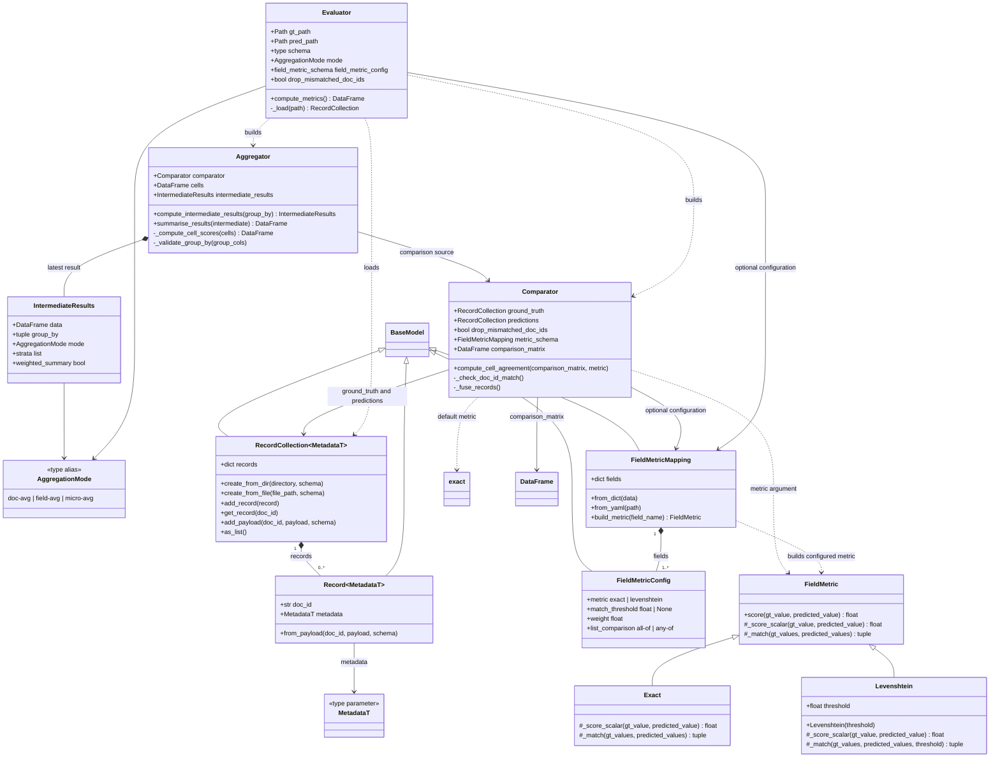

# Architecture

## Class Diagram

```mermaid
classDiagram
    class MetadataT {
        <<type parameter>>
    }

    class AggregationMode {
        <<type alias>>
        doc-avg | field-avg | micro-avg
    }

    class Record~MetadataT~ {
        +str doc_id
        +MetadataT metadata
        +from_payload(doc_id, payload, schema)
    }

    class RecordCollection~MetadataT~ {
        +dict records
        +create_from_dir(directory, schema)
        +create_from_file(file_path, schema)
        +add_record(record)
        +get_record(doc_id)
        +add_payload(doc_id, payload, schema)
        +as_list()
    }

    class Comparator {
        +RecordCollection ground_truth
        +RecordCollection predictions
        +bool drop_mismatched_doc_ids
        +FieldMetricMapping metric_schema
        +DataFrame comparison_matrix
        +compute_cell_agreement(comparison_matrix, metric)
        -_check_doc_id_match()
        -_fuse_records()
    }

    class Aggregator {
        +Comparator comparator
        +DataFrame cells
        +IntermediateResults intermediate_results
        +compute_intermediate_results(group_by) IntermediateResults
        +summarise_results(intermediate) DataFrame
        -_compute_cell_scores(cells) DataFrame
        -_validate_group_by(group_cols)
    }

    class Evaluator {
        +Path gt_path
        +Path pred_path
        +type schema
        +AggregationMode mode
        +field_metric_schema field_metric_config
        +bool drop_mismatched_doc_ids
        +compute_metrics() DataFrame
        -_load(path) RecordCollection
    }

    class IntermediateResults {
        +DataFrame data
        +tuple group_by
        +AggregationMode mode
        +strata list
        +weighted_summary bool
    }

    class FieldMetricMapping {
        +dict fields
        +from_dict(data)
        +from_yaml(path)
        +build_metric(field_name) FieldMetric
    }

    class FieldMetricConfig {
        +metric exact | levenshtein
        +match_threshold float | None
        +weight float
        +list_comparison all-of | any-of
    }

    class FieldMetric {
        +score(gt_value, predicted_value) float
        #_score_scalar(gt_value, predicted_value) float
        #_match(gt_values, predicted_values) tuple
    }

    class Exact {
        #_score_scalar(gt_value, predicted_value) float
        #_match(gt_values, predicted_values) tuple
    }

    class Levenshtein {
        +float threshold
        +Levenshtein(threshold)
        #_score_scalar(gt_value, predicted_value) float
        #_match(gt_values, predicted_values, threshold) tuple
    }

    RecordCollection~MetadataT~ "1" *-- "0..*" Record~MetadataT~ : records
    BaseModel <|-- Record~MetadataT~
    BaseModel <|-- RecordCollection~MetadataT~
    BaseModel <|-- FieldMetricMapping
    BaseModel <|-- FieldMetricConfig
    Record~MetadataT~ --> MetadataT : metadata
    Comparator --> RecordCollection~MetadataT~ : ground_truth and predictions
    Comparator --> FieldMetricMapping : optional configuration
    Comparator ..> FieldMetric : metric argument
    Comparator ..> exact : default metric
    Comparator --> DataFrame : comparison_matrix
    Aggregator --> Comparator : comparison source
    Aggregator *-- IntermediateResults : latest result
    IntermediateResults --> AggregationMode
    FieldMetricMapping "1" *-- "1..*" FieldMetricConfig : fields
    FieldMetricMapping ..> FieldMetric : builds configured metric
    FieldMetric <|-- Exact
    FieldMetric <|-- Levenshtein
    Evaluator ..> RecordCollection~MetadataT~ : loads
    Evaluator ..> Comparator : builds
    Evaluator ..> Aggregator : builds
    Evaluator --> FieldMetricMapping : optional configuration
    Evaluator --> AggregationMode
```
